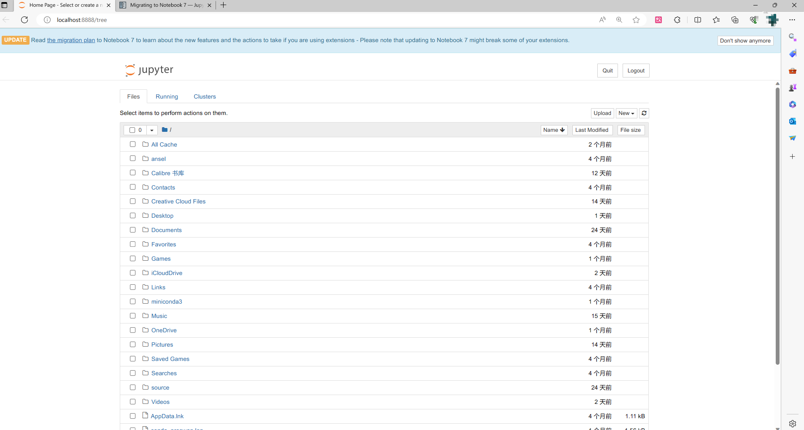

# Python基础入门

> 本课程主要总结自书籍[《Python数据处理》](https://book.douban.com/subject/27074608/)和Github仓库[Python语言基础50课](https://github.com/jackfrued/Python-Core-50-Courses)，开来继往，提炼其中对于城市空间数据初学者的部分。
>
## 1.Python环境配置
在开始学习本课程之前，您需要设置好计算机并准备好在运行notebook。
> 提示：强烈建议新手可以选择不在本地环境运行，可以直接在云端使用。现在有很多免费的云开发工具，比如[Github Codespaces](https://github.com/features/codespaces)，[Google Colab](https://colab.research.google.com/)等等。
> ipad用户可以使用[carnets-jupyter](https://apps.apple.com/cn/app/carnets-jupyter/id1450994949)，界面和jupyter-notebook类似，但是可以直接在ipad上运行，非常方便。

### 1）安装和配置Python环境

#### a.**本地Python环境推荐配置流程：**

1. 安装[Anaconda](https://anaconda.com/)
2. 配置国内源（可选）
3. 安装Python集成开发环境（*IDE*，Integrated Development Environment ）

##### 1.安装Anaconda介绍

Anaconda 是一个用于科学计算的 Python 发行版，支持 Linux, Mac, Windows, 包含了众多流行的科学计算、数据分析的 Python 包。默认情况下，anaconda提供的默认Python环境**base**包含了pandas、numpy等Python包。

Anaconda 安装包官网或者清华大学镜像站可以到 https://mirrors.tuna.tsinghua.edu.cn/anaconda/archive/ 下载，选择最新的版本和对象系统安装即可。比如我可以选择下载Anaconda3-2023.07-1-Windows-x86_64.exe，大小893.8 MiB，更新时间是2023-07-14，下载完成默认下一步安装即可。

##### 2.配置国内源（可选）

1）[anaconda镜像使用](https://mirrors.tuna.tsinghua.edu.cn/help/anaconda/)：各系统都可以通过修改用户目录下的 `.condarc` 文件来使用 TUNA 镜像源。Windows 用户无法直接创建名为 `.condarc` 的文件，可先执行 `conda config --set show_channel_urls yes` 生成该文件之后再修改。.condarc文件：

```
channels:
  - defaults
show_channel_urls: true
default_channels:
  - https://mirrors.tuna.tsinghua.edu.cn/anaconda/pkgs/main
  - https://mirrors.tuna.tsinghua.edu.cn/anaconda/pkgs/r
  - https://mirrors.tuna.tsinghua.edu.cn/anaconda/pkgs/msys2
custom_channels:
  conda-forge: https://mirrors.tuna.tsinghua.edu.cn/anaconda/cloud
  msys2: https://mirrors.tuna.tsinghua.edu.cn/anaconda/cloud
  bioconda: https://mirrors.tuna.tsinghua.edu.cn/anaconda/cloud
  menpo: https://mirrors.tuna.tsinghua.edu.cn/anaconda/cloud
  pytorch: https://mirrors.tuna.tsinghua.edu.cn/anaconda/cloud
  pytorch-lts: https://mirrors.tuna.tsinghua.edu.cn/anaconda/cloud
  simpleitk: https://mirrors.tuna.tsinghua.edu.cn/anaconda/cloud
  deepmodeling: https://mirrors.tuna.tsinghua.edu.cn/anaconda/cloud/
```

2）[pip源使用](https://mirrors.tuna.tsinghua.edu.cn/help/pypi/)：

**临时使用：**

```
pip install -i https://pypi.tuna.tsinghua.edu.cn/simple some-package
```

注意，`simple` 不能少, 是 `https` 而不是 `http`

**设为默认：**

升级 pip 到最新的版本 (>=10.0.0) 后进行配置：

```
Python -m pip install --upgrade pip
pip config set global.index-url https://pypi.tuna.tsinghua.edu.cn/simple
```

如果您到 pip 默认源的网络连接较差，临时使用本镜像站来升级 pip：

```
Python -m pip install -i https://pypi.tuna.tsinghua.edu.cn/simple --upgrade pip
```

##### 3. 安装Python集成开发环境（*IDE*，Integrated Development Environment ）

初学者推荐使用[Jupyter Notebook](https://jupyter.org/)或者JupyterLab（Jupyter Notebook的下一代基于Web的用户界面），前者更简单，没有文件管理和终端，更适合阅读和初学者，官方也提供了[在线演示](https://jupyter.org/try-jupyter/retro/notebooks/?path=notebooks/Intro.ipynb)：


> 提示：翻阅Python教程和库的文档时，经常会被浏览器自带的翻译一头雾水，我推荐一款最近非常流行的免费浏览器翻译插件：[沉浸式翻译](https://immersivetranslate.com/docs/)，其提供双语对照翻译，全平台支持。

让我们打开此插件的插件功能之后，语言便不是障碍了：


在熟悉Python语言之后，我更推荐用[DataSpell](https://www.jetbrains.com/dataspell/)（Pycharm公司开发的Jupyter notebooks）和[Pycharm](https://www.jetbrains.com/pycharm/)进行代码编写，提供Debug调试，Git版本控制、数据库集成，语法高亮，代码补全等功能。我使用最多的编辑器也是这两者，所以本文不会对Jupyter Notebook有过多高级用法的介绍。

### 2）安装常用的Python库或框架

#### 从Anaconda Navigator界面安装（新手推荐）：

打开Anaconda Navigator，进入Environments，选择所在环境，搜索包进行安装。


> 如果遇到了Anaconda Navigator卡在了initiaizing....页面的问题，是因为网络问题，要么挂梯子、要么断网、要么修改文件：
>
> 1. 打开anaconda安装路径，进入如下目录：*anaconda3\Lib\site-packages\anaconda_navigator\utils\attribution*
>
>
> 2. 找到 `resources.py` 以管理员身份打开编辑
> 3. 修改第24行请求代码，在请求后加上timeout限定超时处理：*response: requests.Response = requests.get(url,timeout(0.01,0.1))*

#### 从命令行安装：

1. 创建和激活环境

```bash
# 基于base创建一个新环境，避免破坏基础环境
conda create -n <your_env_name> --clone base # 如果你想创建一个干净的Python环境，则去掉 --clone base
# 激活环境
conda activate <your_env_name>
```

2. 使用conda安装或者使用 pip安装：
```bash
conda install <package>
```
```bash
pip install <package>
```

**conda与pip安装的区别：**

1. `conda`可以创建和管理独立的虚拟环境，每个环境可以有自己的Python解释器和包集合。这使得在不同项目之间隔离包依赖关系变得更加容易。`pip`也可以创建虚拟环境，但是通常需要借助其他工具（如`virtualenv`）来实现。
2. 包源和依赖解析：`conda`可以从多个包源（如Anaconda仓库、conda-forge、arcgis的esri渠道等）中获取软件包，这些包源提供了广泛的软件包集合。`conda`还能够解决包之间的依赖关系，确保安装的软件包及其依赖项兼容。`pip`主要从Python Package Index（PyPI）获取软件包，但在解决依赖关系方面相对较弱，可能需要手动处理依赖项。

**常用软件包还有：**

1. NumPy：一个用于科学计算的库，提供了高性能的多维数组对象和各种数学函数。
2. Pandas：一个用于数据分析和处理的库，提供了高效的数据结构和数据操作工具。
3. Geopandas：基于Python的开源地理数据处理库，它结合了Pandas的数据处理功能和Shapely的地理几何操作，提供了方便的地理数据分析和可视化工具。
4. Shapely是一个基于Python的开源库，用于进行地理几何操作，包括点、线、面等地理对象的创建、编辑和分析。
5. TensorFlow：一个用于机器学习和深度学习的开源库，提供了丰富的工具和功能。
6. PyTorch：一个用于构建深度学习模型的开源机器学习库，提供了动态计算图的支持。
7. Matplotlib：一个用于绘制数据可视化图表的库，提供了各种绘图选项和样式。
8. OpenCV：一个用于计算机视觉和图像处理的开源库，提供了各种图像处理和计算机视觉算法。
9. Arcpy：`arcpy`是ArcGIS软件的Python库，用于地理信息系统（GIS）数据处理和空间分析。它提供了许多功能和工具，用于读取、写入、处理和分析地理空间数据。`arcpy`可以用于自动化地理数据处理任务、地图制作、空间分析等。
10. Scikit-learn：一个用于机器学习的库，提供了各种常用的机器学习算法和工具。
11. Django：一个强大的Web应用框架，用于构建高效的、可扩展的Web应用程序。
12. requests：`requests`是一个简洁而强大的Python库，用于发送HTTP请求和处理HTTP响应。它提供了简单易用的API，使得与Web服务进行通信变得简单。
13. selenium：`selenium`是一个用于Web应用程序测试和自动化的Python库。它可以模拟用户与浏览器的交互，实现自动化操作，例如填写表单、点击按钮、抓取网页内容等。

## 2.运行第一个命令

运行你的IDE程序，如果你是Jupyter Notebook，打开Windows的命令提示符（Mac则为终端），输入

```
conda activate <your_env_name>
```

确保激活环境，命令行开头从`(base) PS C:\Users\用户名>`变成了`<your_env_name> PS C:\Users\用户名>`，然后输入：

```
jupyter notebook
```

这将会在默认浏览器中打开Jupyter Notebook的界面。你可以在这里创建新的笔记本、运行代码和编辑文本。

> 如果未安装，则在Anaconda程序中进行安装。



点击new-python3创建一个notebook笔记本，接下来就可以愉快的敲代码了。

我们写入`print('hello, world')`，这是我们接触的一个函数，按shift+enter运行，输出如下：


如果想让notebook的文件夹在某个文件夹中打开，临时的办法是在文件夹中右键打开命令提示符运行`jupyter notebook`，也就是命令提示符开头显示的文件路径是什么，就会在此文件路径打开。

## 3.注释你的代码

注释是编程语言的一个重要组成部分，用于在源代码中解释代码的作用从而增强程序的可读性。当然，我们也可以将源代码中暂时不需要运行的代码段通过注释来去掉，这样当你需要重新使用这些代码的时候，去掉注释符号就可以了。简单的说，**注释会让代码更容易看懂但不会影响程序的执行结果**。

Python中有两种形式的注释：

1. 单行注释：以`#`和空格开头，可以注释掉从`#`开始后面一整行的内容。

    例如，在我们之前的函数前添加`# `，或者使用快捷键`ctrl+/`，mac则是`command+/`，后文对于只需将ctrl替换为command的mac快捷键将不做说明。

```
# print('hello, world')
```

再次运行此命令不会输出任何内容。


2. 多行注释：三个引号开头，三个引号结尾，通常用于添加多行说明性内容。

```python
def calculate_average(numbers):
    """
    这个函数用于计算一组数字的平均值。

    参数:
    - numbers: 一个包含数字的列表或元组

    返回值:
    - 平均值: 一个浮点数，表示输入数字的平均值
    """

    total = sum(numbers)
    average = total / len(numbers)
    return average
```


# 重要说明

以上是针对初学者的环境配置教程，结合自己的经验推荐了一套流程，而接下来的Python的基础知识已经有很多人做过了，为了不重复造轮子，同时又针对城市空间研究，我会推荐Python入门课程的目录，其中链接的教程会兼顾简单但是最基础的概念。在完成基础学习之后再去学习Pthon相关的库，并且会结合实际项目进行演示。

**最基础的知识：**

1. [Python3 基础语法 ](https://www.runoob.com/python3/python3-basic-syntax.html)
2. [Python3 基本数据类型 ](https://www.runoob.com/python3/python3-data-type.html)
3. [Python3 基本数据类型 ](https://www.runoob.com/python3/python3-data-type.html)
4. [Python3 运算符 ](https://www.runoob.com/python3/python3-basic-operators.html)
5. [Python3 数字(Number)](https://www.runoob.com/python3/python3-number.html)
6. [Python3 字符串](https://www.runoob.com/python3/python3-string.html)
7. [Python3 列表](https://www.runoob.com/python3/python3-list.html)
8. [Python3 元组 ](https://www.runoob.com/python3/python3-tuple.html)
9. [Python3 字典](https://www.runoob.com/python3/python3-dictionary.html)
10. [Python3 集合](https://www.runoob.com/python3/python3-set.html)

**函数与逻辑：**

1. [Python3 条件控制](https://www.runoob.com/python3/python3-conditional-statements.html)
2. [Python3 循环语句](https://www.runoob.com/python3/python3-loop.html)
3. [Python3 函数](https://www.runoob.com/python3/python3-function.html)

**扩展：**

1. [Python3 推导式](https://www.runoob.com/python3/python-comprehensions.html)
2. [ Python3 迭代器与生成器](https://www.runoob.com/python3/python3-iterator-generator.html)
3. [Python3 数据结构](https://www.runoob.com/python3/python3-data-structure.html)
4. [Python3 模块](https://www.runoob.com/python3/python3-module.html)
5. [Python3 输入和输出](https://www.runoob.com/python3/python3-inputoutput.html)

**进阶：**

1. [Python3 面向对象](https://www.runoob.com/python3/python3-class.html)

**[python标准库](https://www.runoob.com/python3/python3-stdlib.html)：**

- os 模块：os 模块提供了许多与操作系统交互的函数，例如创建、移动和删除文件和目录，以及访问环境变量等。
- sys 模块：sys 模块提供了与 Python 解释器和系统相关的功能，例如解释器的版本和路径，以及与 stdin、stdout 和 stderr 相关的信息。
- time 模块：time 模块提供了处理时间的函数，例如获取当前时间、格式化日期和时间、计时等。
- datetime 模块：datetime 模块提供了更高级的日期和时间处理函数，例如处理时区、计算时间差、计算日期差等。
- random 模块：random 模块提供了生成随机数的函数，例如生成随机整数、浮点数、序列等。
- math 模块：math 模块提供了数学函数，例如三角函数、对数函数、指数函数、常数等。
- re 模块：re 模块提供了正则表达式处理函数，可以用于文本搜索、替换、分割等。
- json 模块：json 模块提供了 JSON 编码和解码函数，可以将 Python 对象转换为 JSON 格式，并从 JSON 格式中解析出 Python 对象。

最后有空可以做个[Python 测验](https://www.runoob.com/quiz/python-quiz.html)。
