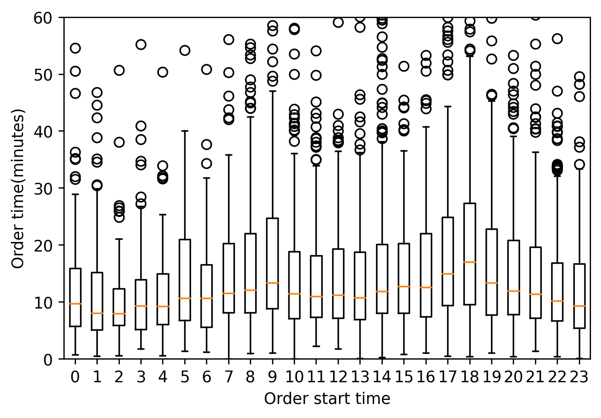
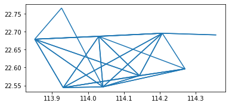

# 说明

[TOC]

## notebook中的图：

**小时数据量的统计**

---

以下未整理：

## 二、出租车数据集收集

> [!INFO]
>
> 下列数据比较旧了。

### 1.深圳电动出租车数据

**数据集全名：** Description for Electric Vehicle Data Release V0&Description for Urban Data Release V2

**下载链接：** [https://www.cs.rutgers.edu/~dz220/data.html](https://www.cs.rutgers.edu/~dz220/data.html)

**简介：** 罗格斯大学助理教授Desheng Zhang课题组电动出租车数据集，包括深圳市单日664辆出租车的1,155,654条GPS数据。

**时间：** 2013-10-22

![[image-20231224164835254.png]]
![[image-20231224164838405.png]]

![[image-20231224145322649.png]]

**相关文章：** [【数据获取】深圳市手机信令数据下载与处理(包括ETC/公交卡/出租车轨迹等)](http://mp.weixin.qq.com/s?__biz=MzA3NTk0MTU3MA==&mid=2247525398&idx=1&sn=caa592607870f5ae1deeb4f1f84865af&chksm=9f6af7bba81d7eadd980ea6058ef7c288424956dfb765fbe4b7351f40ab0aa7793d25904357a&scene=21#wechat_redirect)

### 2. 成都市2014年出租车数据

**链接：**

[https://js.dclab.run/v2/cmptDetail.html?id=175](https://js.dclab.run/v2/cmptDetail.html?id=175)

**说明：** 赛事期间开放了成都市2014年08月03日到2014年08月30日1.4万余辆出租车14亿多条出租车GPS数据。

现数据竞赛已截止，虽然仍可报名，但下载不了数据，需要找保存过的人获取。这个在知乎上有一个公开的百度盘链接，在该回答的评论里可以找到，我也分享一份

百度网盘：[链接🔗](https://pan.baidu.com/s/10GjFUTUg58pp7ylRvnwbig?pwd=twa4)

### **3.北京市2008年 T-Drive轨迹数据**

**数据简介：** 包含北京市2008年02月02日到2008年02月08日共10,357 辆出租车的一周轨迹。该数据集中的总点数约为 1500 万个，轨迹总距离达到 900 万公里。

**下载链接：** https://www.microsoft.com/en-us/research/publication/t-drive-trajectory-data-sample/

> [!TIP]
>
> 数据下载需要国外网络环境。  

### 4.深圳开放数据应用创新大赛

说明：出租车GPS数据分析深圳道路交通情况，该数据压缩包大小约为1.4GB，解压后文件约为9.3GB，无法放入支撑材料中。

1. 每条路线起点在对应文件中对应序号

2. 每条路线终点在对应文件中对应序号

3. 该条路线车辆载客状态(载客-1/空载-0)

4. 该条路线所属车辆

5. 该条路线出发时间（以'00-Jan-0000 00:00:00 '为0 ，以1天为1单位）

6. 该条路线结束时间（以'00-Jan-0000 00:00:00 '为0 ，以1天为1单位）

7. 该条路线运行距离 (km)

8. 出发点经/纬度 (北纬)

9. 终点经/纬度（东经）

10. 该条路径花费时长(min )

11. 该条路径车费收入(只有载客的路径才有收入) 且按照论文中“2011年出租车运营收费计算”。

##### 2014年06
https://www.heywhale.com/mw/dataset/638ec7928cb7440653cbc309/file

##### 2019年未找到
##### 2021-11-08号的数据

虽然竞赛是2019年的，但是提供的数据是2011年的，百度网盘：[链接🔗](https://pan.baidu.com/s/13qwVSB--8KZjrhlkZaOVAA?pwd=tq0h)

https://github.com/zhangchenhaoseu/Quadtree-and-data-sparseness/blob/main/data/24DataFrame_O.txt

  

### 5.纽约市出租车和豪华轿车委员会（TLC）

**链接：** https://www1.nyc.gov/site/tlc/about/tlc-trip-record-data.page

**数据说明：**包含2009年01月到2021年07月纽约市出租车轨迹、运营数据。具体信息可以点击以下文章查看：

  

有人分享过百度网盘链接：[【数据分享】纽约出租车轨迹、运营数据（243G）](https://mp.weixin.qq.com/s?__biz=MzA3NTk0MTU3MA==&mid=2247504966&idx=1&sn=cffd34f3e7326d2da2b2e515cb32be1f&chksm=9f6a47eba81dcefd3cf91911adf6627f31c125daea2402fca90a62410806d9fcd893f4aaadf2&scene=21#wechat_redirect)

