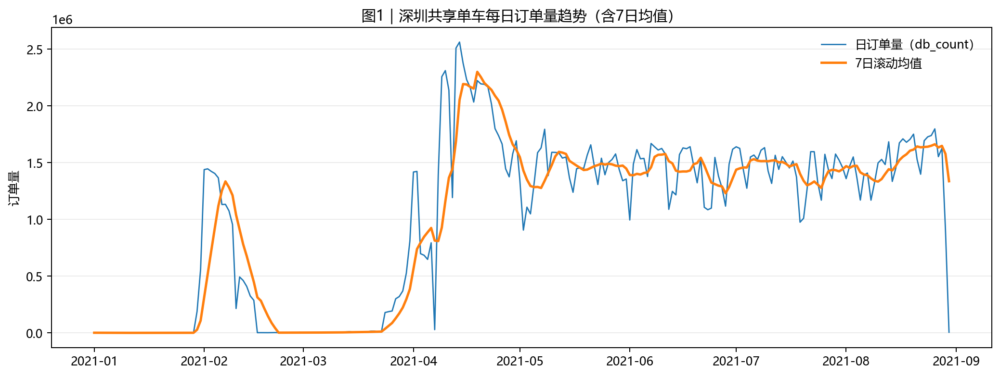
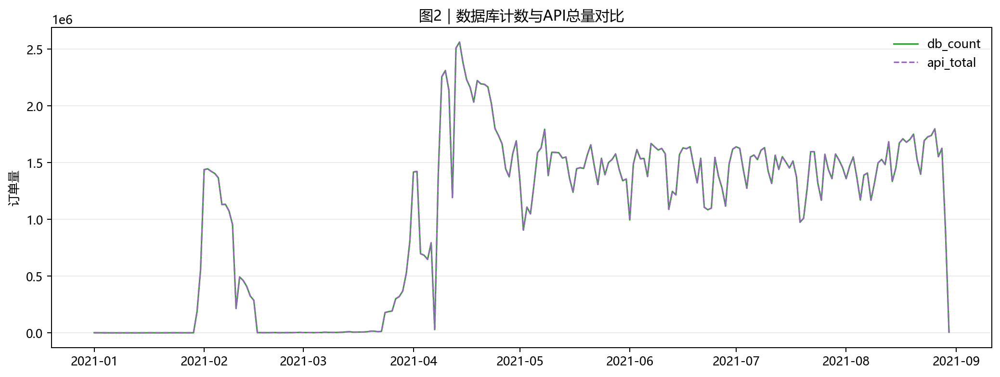
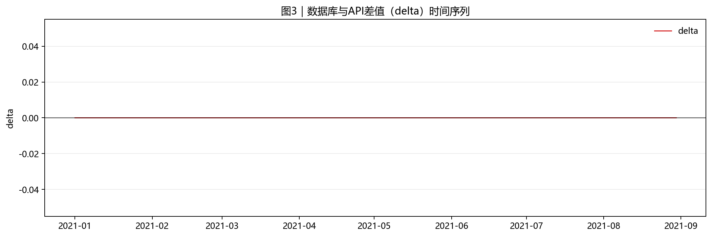
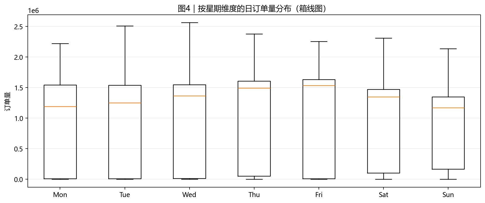
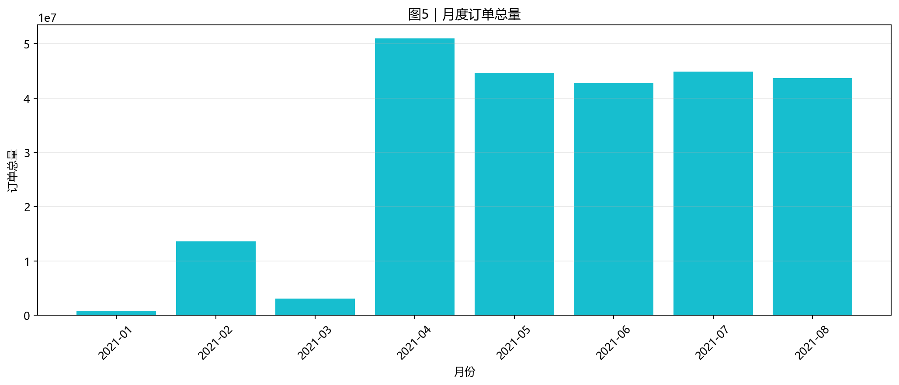
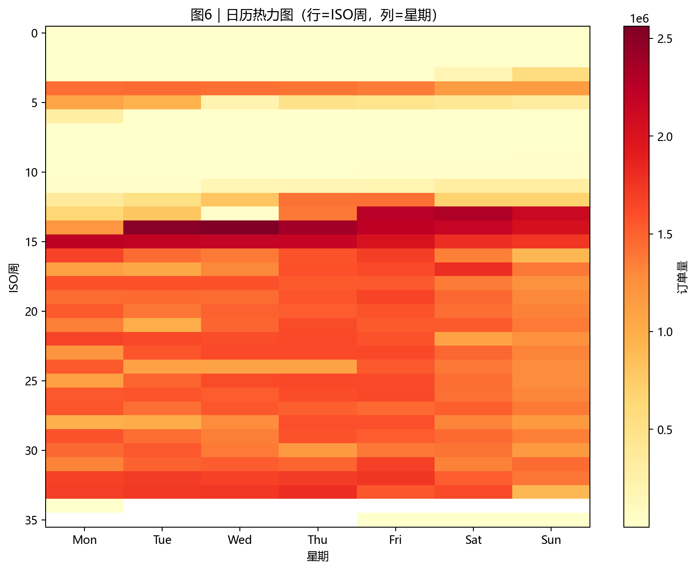
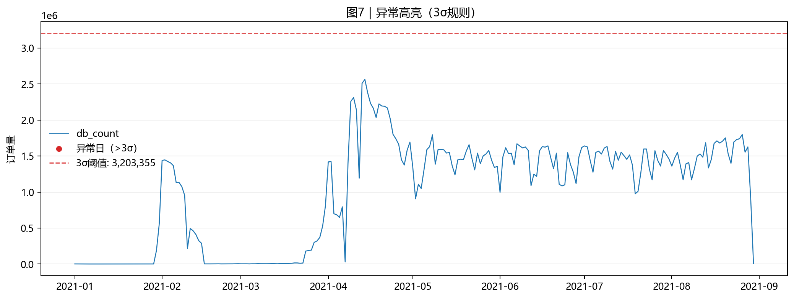

# 数据分享导出说明

本目录包含通过优化数据管道导出的## 坐标系说明

### WGS84 目录（推荐）
- **用途**：正式分析、地图叠加、与其他数据集结合
- **特点**：标准坐标系，与 GPS、卫星图像、OpenStreetMap 等完全兼容
- **精度**：点位与地图底图精确对齐

### RAW 目录
- **用途**：快速浏览、教学演示、保留原始数据
- **特点**：保留平台原始坐标（通常为 BD09LL 或 GCJ-02）
- **注意**：与标准地图可能有轻微偏移（几十到几百米）

## 格式选择建议

- **CSV（zip）**：推荐给表格分析/简单查看的用户；体积较大，已压缩
- **GeoJSON（zip）**：推荐给地图可视化/空间分析的用户；体积较大，已压缩；几何为对应目录的"起点"坐标

## 📊 数据规模看板（每日订单量）

> 数据范围：`2021-01-01` ~ `2021-08-30`（共 `242` 天）  
> 总记录数：`244,412,855` 条（约 2.44 亿）
















## 目录结构

```text
data/share/
  wgs84/                    # WGS84坐标系（推荐用于分析）
    csv_zip/                # 每天一个 zip，里面是 CSV 表格
    geojson_zip/            # 每天一个 zip，里面是 GeoJSON（可以直接做地图）
  raw/                      # 原始坐标系（快速浏览用）
    csv_zip/                # 同上
    geojson_zip/            # 同上
```

格式选择建议（默认仅提供两种）：

- CSV（zip）：推荐给表格分析/简单查看的用户；体积较大，已压缩。
- GeoJSON（zip）：推荐给地图可视化/空间分析的用户；体积较大，已压缩；几何为对应目录的“起点”坐标。

## 字段说明

### 核心字段（所有格式通用）

- **user_id**：匿名化用户标识，仅用于同一用户维度的统计（如行程计数、活跃度等），不用于身份识别
- **company_id**：运营公司
- **start_time_cn/end_time_cn**：北京时间字符串

### 坐标字段（根据目录不同）

#### WGS84 目录
- **start_lng_wgs84/start_lat_wgs84**：起点经纬度（WGS84坐标系）
- **end_lng_wgs84/end_lat_wgs84**：终点经纬度（WGS84坐标系）
- **GeoJSON 几何**：起点坐标的空间几何

#### RAW 目录  
- **start_lng_raw/start_lat_raw**：起点经纬度（原始坐标系）
- **end_lng_raw/end_lat_raw**：终点经纬度（原始坐标系）
- **GeoJSON/Gearquet 几何**：起点坐标的空间几何（原始坐标系）

## 数据来源与处理

- **来源**：深圳市政府数据开放平台
- **时间范围**：2021年1月1日 - 2021年8月30日（约2.44亿条记录）
- **处理流程**：
  1. 实时采集原始数据
  2. 同步完成坐标系转换（BD09LL/GCJ-02 → WGS84）
  3. TimescaleDB 分区存储
  4. 按需导出双坐标系数据

## 使用建议

1. **新用户**：建议从 wgs84/csv_zip/ 开始，用 Excel 或类似工具查看
2. **地图可视化**：使用 wgs84/geojson_zip/，配合 kepler.gl 或 QGIS
3. **大数据分析**：使用 parquet 或 geoparquet 格式，配合 pandas/dask
4. **快速浏览**：可以使用 raw 目录，但注意坐标系偏移

## 注意事项

- 超大日数据建议适当调小 --batch 以降低内存占用；脚本使用流式读取，默认 50k/批
- WGS84 坐标适合与其他地理数据集进行空间分析和叠加
- 原始坐标保留了数据的原始特征，适合特定场景的研究
